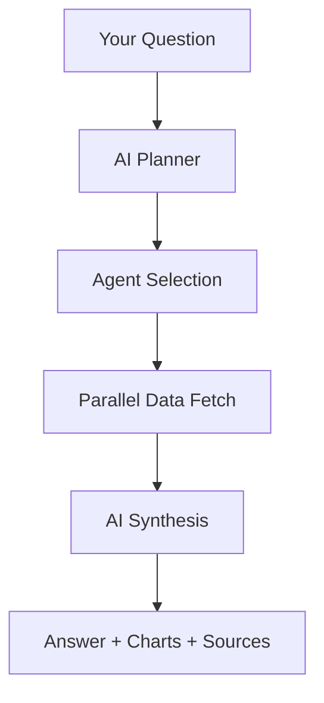

## What is an Agent?

An agent is a specialist module that knows how to fetch and interpret one type of market data. Instead of relying on a single general-purpose AI, ClearView deploys the right combination of specialists for every question you ask.

Each agent:
- Connects to a specific data source (Binance, EODHD, FRED, DefiLlama)
- Fetches real, verified data in real-time
- Structures the data for analysis
- Returns results with full source attribution

**The AI never invents data.** Every number in a ClearView response comes from a verified source, and every response tells you exactly where each data point originated.

## How the Pipeline Works

When you send a question, ClearView follows a consistent 4-step process:

<Steps>
  <Step title="AI Planner analyzes your question">
    A planning model reads your question and decides which agents are needed. You can see this reasoning in the "Plan" block at the top of every response.
  </Step>
  <Step title="Agents fetch data in parallel">
    The selected agents run simultaneously, each pulling data from their respective sources. Complex questions may invoke 3-4 agents at once with no added wait time.
  </Step>
  <Step title="AI synthesizes a response">
    A synthesis model reads all the agent data and writes a coherent analysis. It can only reference data the agents actually returned -- it cannot generate numbers from memory.
  </Step>
  <Step title="You receive the answer with sources">
    The response includes text analysis, interactive charts, and a source attribution section showing exactly which API endpoints provided each data point.
  </Step>
</Steps>

## The 9 Agents

Agents are organized into three groups based on their role in the analysis pipeline.

### Crypto Data Agents

These agents fetch raw market data from crypto-native sources.

| Agent | Specialty | Data Source |
|-------|-----------|-------------|
| **Derivatives** | Funding rates, open interest, long/short positioning, taker buy/sell volume | Binance Futures |
| **Macro** | Cross-asset prices (BTC, ETH, SPX, VIX, DXY), stablecoin supply | Binance + EODHD + DefiLlama |
| **Signals** | Long/short positioning ratios across multiple pairs | Binance Futures |
| **On-Chain** | Blockchain metrics (MVRV, NUPL, SOPR, whale activity) | Currently being rebuilt on BigQuery |

### TradFi Data Agent

| Agent | Specialty | Data Source |
|-------|-----------|-------------|
| **TradFi** | Stock prices, company fundamentals, economic/earnings calendar, forex, yield curve, FRED macro indicators | EODHD + FRED + Finnhub |

### Analysis Agents

These agents interpret data using structured analytical frameworks. They compute exact numbers and produce charts.

| Agent | Specialty | What It Does |
|-------|-----------|--------------|
| **[Technical](/agents/technical)** | Technical analysis (RSI, MACD, Bollinger, ADX, ATR) | Applies a 5-layer epistemic framework where the market regime (trending vs. ranging) conditions how every indicator is interpreted |
| **[Advisor](/agents/advisor)** | Financial advisory (deep dives, scanner, portfolio) | Comprehensive company analysis with 8 sections, natural-language market screening, multi-position portfolio review |
| **[Quantitative](/agents/quantitative)** | Statistical analysis | Return distributions, seasonality patterns, range compression detection, volatility regime classification -- all computed with pandas/numpy |
| **[Structure](/agents/structure)** | Market structure (P1/P2) | Directional bias from temporal order of price extremes, multi-timeframe fractal alignment, flip risk assessment |

## Key Principles

<CardGroup cols={2}>
  <Card title="You don't pick agents" icon="wand-magic-sparkles">
    The AI planner figures out which agents to use based on your question. Just ask naturally.
  </Card>
  <Card title="Multiple agents run in parallel" icon="bolt">
    Complex questions invoke several agents simultaneously. "How does BTC look?" triggers Technical + Derivatives + Signals + Macro at the same time.
  </Card>
  <Card title="Every data point is attributed" icon="link">
    The Sources section at the bottom of every response shows exactly which API endpoints provided each piece of data.
  </Card>
  <Card title="Failures are transparent" icon="triangle-exclamation">
    If an agent cannot fetch data (API down, invalid ticker, etc.), the response tells you explicitly. You will never receive silently fabricated data.
  </Card>
</CardGroup>

<Tip>
You can combine agents by asking multi-faceted questions. For example, "Give me the technical setup, derivatives data, and P1/P2 structure for BTC" will invoke Technical, Derivatives, and Structure agents in a single query.
</Tip>

<Note>
The On-Chain agent is temporarily unavailable while blockchain metrics are being migrated to a new infrastructure (BigQuery). Queries about on-chain data will return a clear status message rather than stale data.
</Note>
