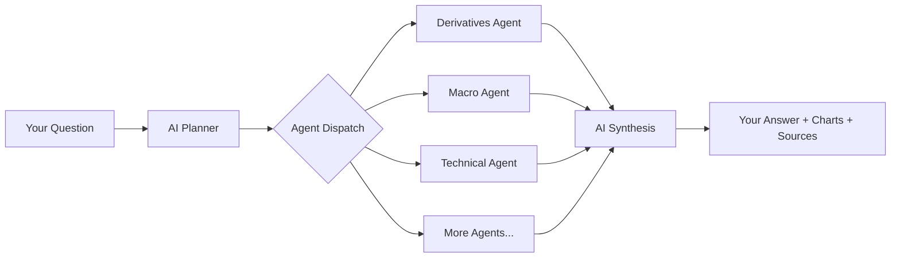

ClearView Portal is a multi-agent AI platform that answers your questions about financial markets using real-time data from primary sources. Ask anything about crypto, derivatives, macro, equities, or market structure — and get analysis grounded in verified data, not AI guesses.

<CardGroup cols={2}>
  <Card title="9 Specialized Agents" icon="robot">
    Each agent is an expert in one domain — derivatives, macro, technical analysis, quantitative stats, and more. They work together to answer complex questions.
  </Card>
  <Card title="Real Data Only" icon="database">
    Every number comes from a verified source: Binance, DefiLlama, EODHD, FRED. The AI never invents data — it analyzes what the agents fetch.
  </Card>
  <Card title="Charts & Tables" icon="chart-line">
    Responses include inline candlestick charts, bar charts, funding rate timeseries, and structured data tables — not just text.
  </Card>
  <Card title="Source Attribution" icon="link">
    Every response cites which data source and endpoint provided each data point, so you can verify anything independently.
  </Card>
</CardGroup>

## How it works

1. You ask a question in natural language
2. The AI planner decides which specialized agents to invoke
3. Agents fetch real-time data from exchanges and data providers in parallel
4. The AI synthesizes a response using only the fetched data
5. You receive analysis with charts, tables, and cited sources

## What's included

<CardGroup cols={2}>
  <Card title="Platform Pages" icon="browser" href="/platform/home">
    10 dashboard pages with live market data — derivatives, signals, macro, markets, calendar, economy, and more.
  </Card>
  <Card title="AI Chat" icon="message-bot" href="/platform/chat">
    Ask anything about markets. The AI orchestrates multiple agents to give you comprehensive, data-backed answers.
  </Card>
  <Card title="Automated Reports" icon="clock" href="/reports/dashboard">
    Schedule daily or weekly market reports delivered to Telegram, Discord, or email.
  </Card>
  <Card title="AI Agents" icon="brain" href="/agents/overview">
    9 specialized agents covering derivatives, macro, technical analysis, financial advisory, quantitative stats, and market structure.
  </Card>
</CardGroup>
